**Co-Founder & Engineer — building privacy-first DeFi and open marketplaces on Stellar.**

  
  
  
  

---

## 🚀 What I'm Building

I co-found and ship products at the intersection of **Bitcoin, DeFi, privacy and open marketplaces** — all on **Stellar / Soroban**.

<table>
<tr>
<td width="33%" valign="top">

### ₿ Writz Protocol
**Co-Founder**

Trustless **Bitcoin lending** on Stellar. Lock native BTC from your own wallet, borrow USDC, and keep every position private.

`Bitcoin Script` `SPV on Soroban` `Groth16 ZK`

No bridge · No custodian · No wrapped tokens

</td>
<td width="33%" valign="top">

### 🤝 Offer-Hub
**Co-Founder**

A **freelance marketplace orchestrator** connecting professionals and clients worldwide, with on-chain escrow and Stellar-native payments.

`NestJS` `Prisma` `Next.js` `Stellar`

</td>
<td width="33%" valign="top">

### 🌌 Galaxy DevKit
**Co-Founder**

The **abstraction layer that simplifies Stellar**. Plug DeFi services and wallets into any app through clean APIs — no blockchain complexity.

`TypeScript` `SDK` `DeFi APIs`

</td>
</tr>
</table>

---

## 🧠 About Me

- 🏗️ **Co-Founder** of [Writz Protocol](https://github.com/WritzProtocol), [Offer-Hub](https://github.com/OFFER-HUB) and [Galaxy](https://github.com/Galaxy-KJ)
- 🔐 Focused on **zero-knowledge privacy**, **Bitcoin ↔ Stellar** interoperability and **smart contract escrow**
- 🛠️ Smart contracts in **Rust / Soroban** and **Cairo**, product in **TypeScript**
- ⚙️ Obsessed with **clean architecture**, **atomic commits** and **open collaboration**
- 🌍 Building in public across the **Stellar ecosystem**

---

## 🧩 Tech Arsenal

**Smart Contracts**

**Product & Infrastructure**

---

## 📊 GitHub Stats

 

  

Rebuilt every 6 hours from the live contribution calendar · <a href="scripts/generate-xp-grid.mjs">generator</a> · <a href=".github/workflows/xp-grid.yml">workflow</a>

---

## 🧭 Current Focus

- ₿ Bringing **Writz** from Soroban testnet to mainnet — native BTC collateral, ZK-private positions
- 🌌 Growing **Galaxy DevKit** into the default integration layer for Stellar DeFi
- 🤝 Scaling **Offer-Hub** as an open, escrow-backed marketplace for Web3 talent
- 🔬 Deep work on **zero-knowledge proofs** and **cross-chain private payments**

---

## 🧘 Beyond Code

> **"Discipline is freedom."**

I build with purpose, not hype — driven by curiosity, consistency and creation.
Off the keyboard you'll find me **training**, **hiking**, or thinking about **game design** and **systems**.

---

### Let's build something that lasts 🌍

  

